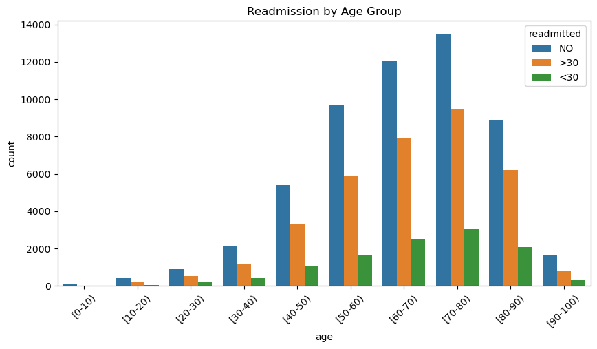
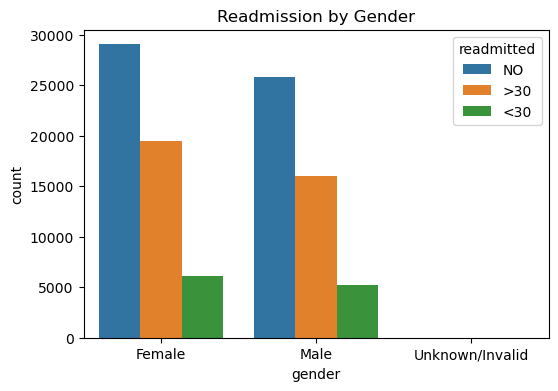
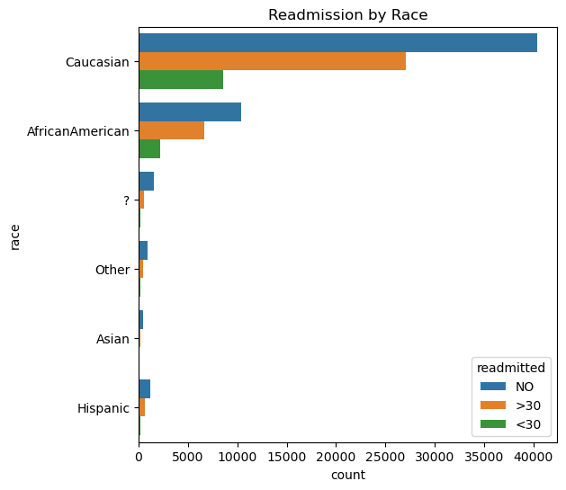
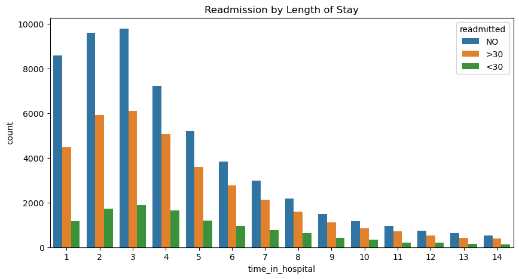
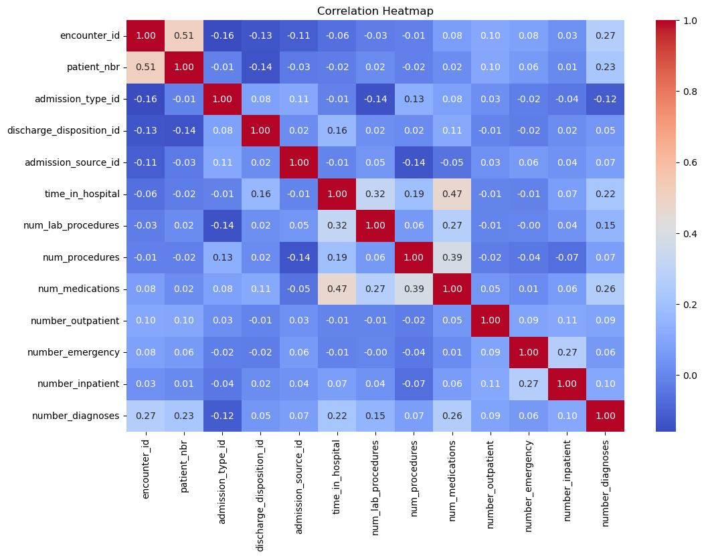

# Hospital Readmission Data Analysis

## Project Overview

This project performs **Exploratory Data Analysis (EDA)** on hospital patient data to uncover patterns and factors influencing patient readmissions.

The goal is to understand key trends in patient demographics, hospital stay duration, and medical conditions before building predictive models.

## 📊 Dataset

* Diabetes 130-US hospitals dataset
* ~101,000 patient records
* Features include age, gender, race, time in hospital, and readmission status

## 🛠 Tools & Technologies

* Python
* Pandas
* NumPy
* Matplotlib
* Seaborn

## 🔍 Analysis Performed

* Data cleaning and preprocessing
* Handling missing values
* Simplifying readmission categories
* Exploratory data analysis (EDA)
* Data visualization
* Correlation analysis

## Key Visualizations & Insights

### Readmission by Age

This visualization shows how hospital readmission varies across different age groups. 
We observe that older patients tend to have higher readmission rates compared to younger patients. This may be due to increased vulnerability, chronic illnesses, and slower recovery rates among elderly individuals.
This suggests that age is an important factor in understanding and predicting hospital readmissions

### Readmission by Gender

This chart compares readmission rates between male and female patients.
The distribution shows that both genders have relatively similar readmission patterns, with no major difference between them. However, slight variations may still exist and could be explored further.
This indicates that gender alone may not be a strong predictor of hospital readmission.

## Readmission by Race

This chart displays readmission patterns across different racial groups.
While some differences can be observed, the variations are not extremely large. These differences may be influenced by factors such as access to healthcare, socioeconomic conditions, or underlying health disparities.
Further investigation would be needed to draw strong conclusions.

### Readmission by Length of Stay

This visualization examines the relationship between the length of hospital stay and readmission rates.
Patients who stayed longer in the hospital tend to have a higher likelihood of being readmitted. This could indicate that patients with more severe conditions require longer stays and are also at higher risk of returning for further treatment.
This suggests that length of stay is an important factor associated with readmission risk.

### Correlation Heatmap

The correlation heatmap shows the relationships between numerical variables in the dataset.
Most variables show weak correlations with each other, indicating that no single feature strongly determines readmission. Instead, readmission is likely influenced by a combination of multiple factors.
This highlights the complexity of predicting hospital readmissions and the need for more advanced analysis or modeling.

## Key Insights

* Older patients are more likely to be readmitted
* Longer hospital stays increase readmission risk
* Chronic conditions play a major role in readmission
* No strong single predictor — multiple factors contribute

## Project Structure
hospital-readmission-analysis/
│
├── data/
├── images/
├── notebooks/
│   └──Project1 .ipynb
└── README.md

## How to Run the Project

git bash
pip install -r requirements.txt
jupyter notebook

Open:
notebooks/analysis.ipynb

## Future Work

* Build machine learning models to predict readmission
* Perform feature engineering
* Improve model accuracy and evaluation

By **Korang Pearl Antwi**
